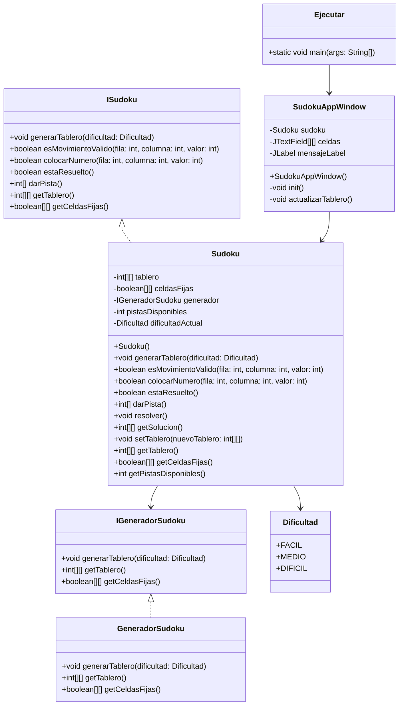

```mermaid  
classDiagram
    class ISudoku {
        +void generarTablero(dificultad: Dificultad)
        +boolean esMovimientoValido(fila: int, columna: int, valor: int)
        +boolean colocarNumero(fila: int, columna: int, valor: int)
        +boolean estaResuelto()
        +int[] darPista()
        +int[][] getTablero()
        +boolean[][] getCeldasFijas()
    }

    class IGeneradorSudoku {
        +void generarTablero(dificultad: Dificultad)
        +int[][] getTablero()
        +boolean[][] getCeldasFijas()
    }

    class Sudoku {
        -int[][] tablero
        -boolean[][] celdasFijas
        -IGeneradorSudoku generador
        -int pistasDisponibles
        -Dificultad dificultadActual

        +Sudoku()
        +void generarTablero(dificultad: Dificultad)
        +boolean esMovimientoValido(fila: int, columna: int, valor: int)
        +boolean colocarNumero(fila: int, columna: int, valor: int)
        +boolean estaResuelto()
        +int[] darPista()
        +void resolver()
        +int[][] getSolucion()
        +void setTablero(nuevoTablero: int[][])
        +int[][] getTablero()
        +boolean[][] getCeldasFijas()
        +int getPistasDisponibles()
    }

    class GeneradorSudoku {
        +void generarTablero(dificultad: Dificultad)
        +int[][] getTablero()
        +boolean[][] getCeldasFijas()
    }

    class SudokuAppWindow {
        -Sudoku sudoku
        -JTextField[][] celdas
        -JLabel mensajeLabel

        +SudokuAppWindow()
        -void init()
        -void actualizarTablero()
    }

    class Ejecutar {
        +static void main(args: String[])
    }

    class Dificultad {
        +FACIL
        +MEDIO
        +DIFICIL
    }

    %% Relaciones
    ISudoku <|.. Sudoku
    IGeneradorSudoku <|.. GeneradorSudoku
    Sudoku --> IGeneradorSudoku
    Sudoku --> Dificultad
    SudokuAppWindow --> Sudoku
    Ejecutar --> SudokuAppWindow


```