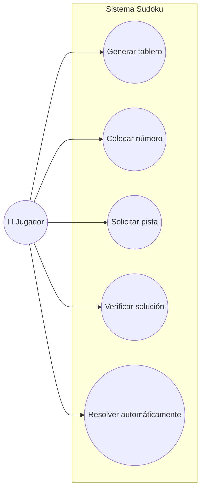
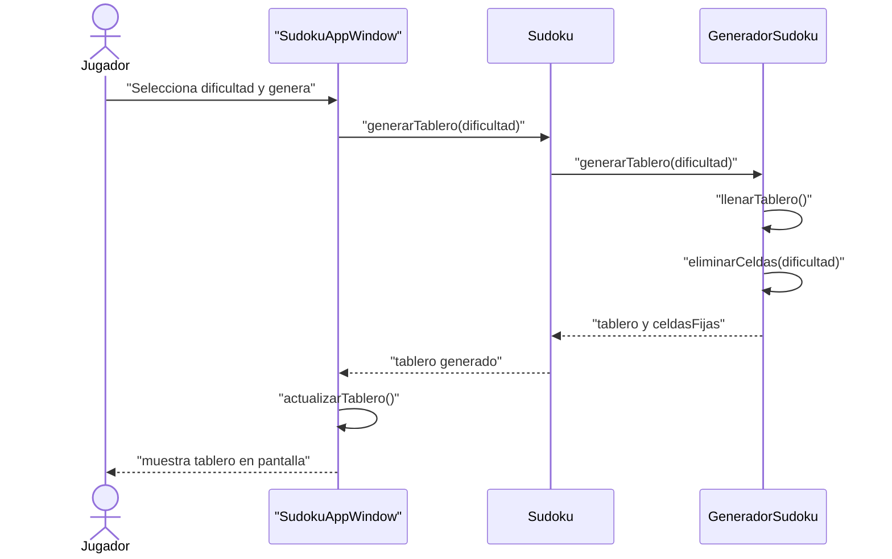
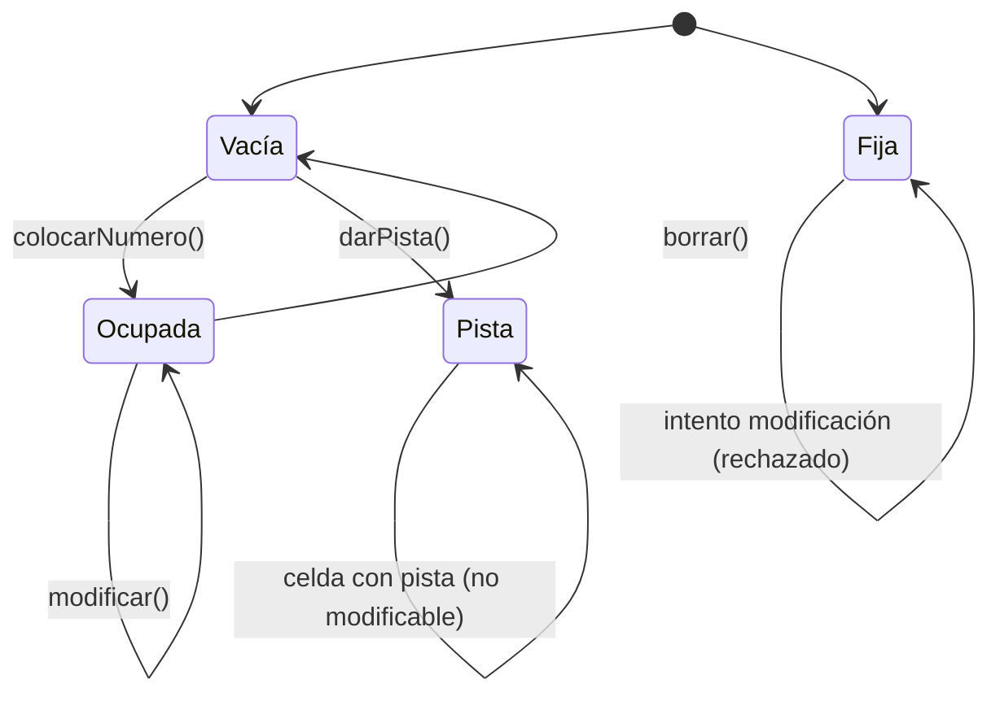
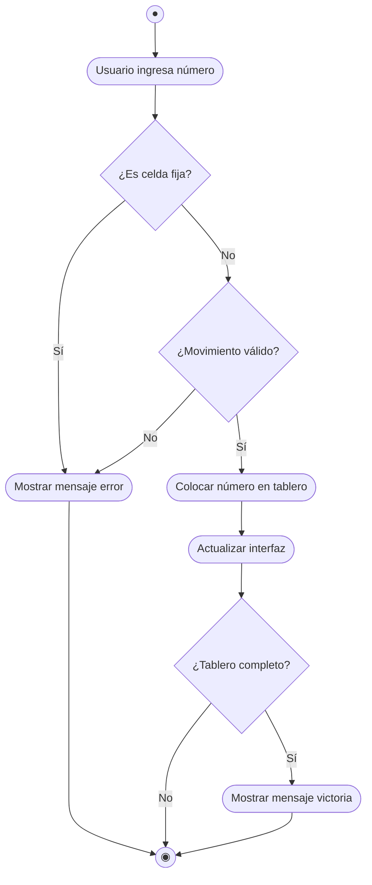

# Proyecto Sudoku - Aplicación de Escritorio  
  
Desarrollar una aplicación de escritorio en Java donde los usuarios puedan jugar Sudoku con diferentes niveles de dificultad. La aplicación permite generar tableros aleatorios, validar movimientos, solicitar pistas limitadas según la dificultad, y resolver automáticamente el puzzle. Implementa una arquitectura en capas con separación clara entre presentación, lógica de negocio y generación de datos.  
  
La aplicación cuenta con interfaz gráfica Swing, algoritmos de backtracking para generación y resolución, sistema de pistas limitadas por dificultad, y validación en tiempo real de movimientos según las reglas del Sudoku.  
  
---  
  
## 2. Objetivos del Proyecto  
  
| **ID** | **Objetivo SMART** | **Tipo** | **Métrica** | **Fecha Límite** | **Responsable** | **Estado** |  
|--------|-------------------|----------|-------------|------------------|-----------------|------------|  
| OBJ-01 | Implementar generación de tableros válidos en < 2 segundos | Técnico | Tiempo de generación | 2025-06-30 | Desarrollador | Completado |  
| OBJ-02 | Garantizar validación correcta del 100% de movimientos | Funcional | % de validaciones correctas | 2025-06-15 | Desarrollador | Completado |  
| OBJ-03 | Proporcionar sistema de pistas según dificultad (3/2/1) | Funcional | Pistas por nivel | 2025-06-20 | Desarrollador | Completado |  
| OBJ-04 | Mantener interfaz responsiva con tiempos < 100ms | Rendimiento | Tiempo de respuesta UI | 2025-06-25 | Desarrollador | En progreso |  
  
---  
  
## 3. Requisitos Funcionales  
  
| **ID** | **Descripción** | **Prioridad** | **Fuente** | **Estado** |  
|--------|----------------|---------------|------------|------------|  
| RF-01 | Generar tableros Sudoku válidos con 3 niveles de dificultad | Alta | Cliente | Implementado |  
| RF-02 | Validar movimientos según reglas del Sudoku en tiempo real | Alta | Requisitos del juego | Implementado |  
| RF-03 | Proporcionar pistas limitadas según dificultad seleccionada | Media | Cliente | Implementado |  
| RF-04 | Resolver automáticamente el tablero actual | Media | Cliente | Implementado |  
| RF-05 | Verificar si el tablero está completamente resuelto | Alta | Requisitos del juego | Implementado |  
| RF-06 | Interfaz gráfica intuitiva con grid 9x9 | Alta | Usabilidad | Implementado |  
  
---  
  
## 4. Requisitos No Funcionales  
  
| **ID** | **Descripción** | **Categoría** | **Métrica** | **Nivel Objetivo** | **Comentarios** |  
|--------|----------------|---------------|-------------|-------------------|-----------------|  
| RNF-01 | Tiempo de generación de tablero < 2 segundos | Rendimiento | Tiempo de ejecución | < 2s | Algoritmo de backtracking optimizado |  
| RNF-02 | Validación de movimientos < 50ms | Rendimiento | Latencia de validación | < 50ms | Verificación en tiempo real |  
| RNF-03 | Interfaz responsiva sin bloqueos | Usabilidad | Tiempo de respuesta UI | < 100ms | Swing Event Dispatch Thread |  
| RNF-04 | Compatibilidad con Java 8+ | Portabilidad | Versión JVM | Java 8+ | Sin dependencias externas |  
| RNF-05 | Uso de memoria < 50MB durante ejecución | Eficiencia | Consumo RAM | < 50MB | Estructuras de datos optimizadas |  
  
---  
  
## 5. Diagrama de Casos de Uso  
  

## 6. Matriz de Trazabilidad  
  
| **Req. ID** | **Descripción Req.** | **Objetivo(s)** | **Caso de Uso** | **Caso de Prueba** |  
|-------------|---------------------|-----------------|-----------------|-------------------|  
| RF-01 | Generar tableros con dificultad | OBJ-01 | C1 | TP-01: Generación tableros |  
| RF-02 | Validar movimientos | OBJ-02 | C2 | TP-02: Validación movimientos |  
| RF-03 | Sistema de pistas limitadas | OBJ-03 | C3 | TP-03: Pistas por dificultad |  
| RF-04 | Resolver automáticamente | OBJ-01 | C5 | TP-04: Resolución automática |  
| RF-05 | Verificar solución completa | OBJ-02 | C4 | TP-05: Verificación solución |

## 7. Diagrama de Interacción (Secuencia: Generar Tablero)  
  

## 8. Diagrama de Estado (Ciclo de vida de una Celda)  
  

## 9. Diagrama de Actividad (Colocar Número)  
  
